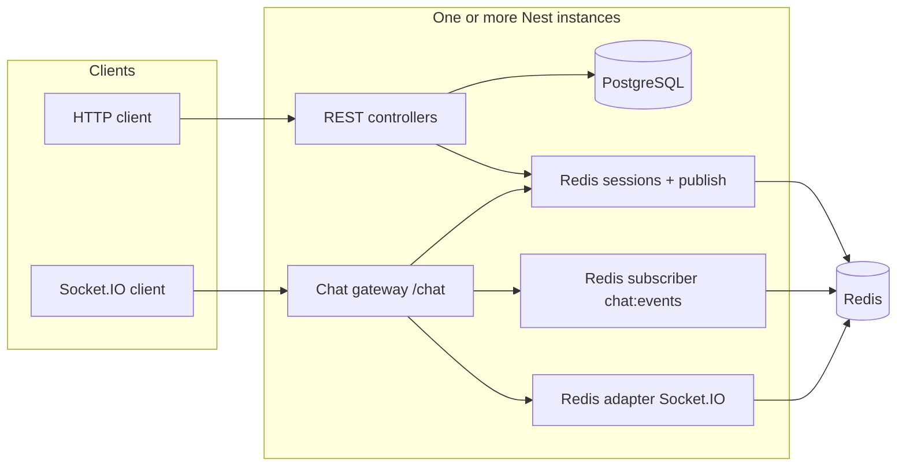

# Architecture

## Overview

The service exposes a JSON REST API for anonymous login, rooms, and messages, and a Socket.IO namespace for live presence and message fan-out. PostgreSQL stores durable data; Redis stores sessions, per-room presence/socket metadata, and coordinates real-time events across processes.

**Flow summary**

1. **Login** creates or loads a user row in Postgres and stores an opaque session in Redis (TTL 24h).
2. **Rooms & messages** use Drizzle for reads/writes; message create and room delete **publish** envelopes to the Redis channel `chat:events` (no Socket emits inside REST controllers).
3. Each server runs **Socket.IO** with **`@socket.io/redis-adapter`** so socket rooms and broadcasts work across nodes.
4. Each server **subscribes** to `chat:events` and emits `message:new` / `room:deleted` into the appropriate Socket.IO room so **every connected client** (including on other instances) receives events.

---

## Session strategy

| Aspect | Implementation |
|--------|----------------|
| **Token** | Opaque random string (`generateSessionToken`), not JWT. |
| **Storage** | Redis key `chat:sess:<token>` → JSON `{ id, username, createdAt }`, **`EX` 86400** (24 hours). |
| **Login semantics** | Username is unique in Postgres; repeated login returns the **same user** with a **new** token and **new** Redis session entry. |
| **HTTP auth** | `Authorization: Bearer <token>` resolved via `SessionAuthGuard`; missing/expired token → **401** with code `UNAUTHORIZED`. |
| **WebSocket auth** | Query `token`; invalid/expired → disconnect (contract: treat as 401). Unknown `roomId` → disconnect (404). |

Expiry is enforced only when Redis drops the key (TTL) or when the token is rejected on each request/handshake—there is no server-side session refresh in this codebase.

---

## Redis pub/sub and WebSocket fan-out

Three Redis roles matter:

1. **Socket.IO Redis adapter** — Dedicated Redis pub/sub pair (`createAdapter(pub, sub)`) so Socket.IO rooms and emits replicate across all running Nest processes.

2. **Application channel `chat:events`** — REST publishes JSON envelopes after DB commits:

   - `message:new` — `{ event, roomId, payload: { id, username, content, createdAt } }`
   - `room:deleted` — `{ event, roomId, payload: { roomId } }`

   Each instance subscribes with a duplicate Redis connection and runs `server.to(roomId).emit(...)`. That way **publishers do not call Socket.IO from controllers**, but every node still delivers to local sockets joined to `roomId`.

3. **Presence / connection state** — No in-memory maps: presence sets, per-user socket sets, and `chat:socket:<socketId>` strings live in Redis (see `SocketPresenceService`, `RoomPresenceService`). Active user counts for REST use `SCARD` on the same presence set used by WebSockets.

---

## Estimated capacity (single instance)

Rough **order-of-magnitude** only—measure your own workload.

- **CPU-bound:** Node handles many concurrent **idle** WebSockets efficiently (event loop + small payloads). A single mid-size VM (e.g. 2 vCPU, 4 GB RAM) often sustains **low tens of thousands** of mostly idle connections if Redis and Postgres are healthy and payloads stay small.
- **Limits in practice:** Postgres write throughput on **message inserts**, Redis command rate (publish + presence updates), and **outbound bandwidth** for chat bursts dominate before raw socket count.
- **Conservative planning:** For **mixed** REST + chat with bursts, **thousands of concurrent connected users** per instance is a reasonable starting assumption until profiled; beyond that, horizontal scaling (below) matters more than vertical CPU.

---

## Scaling to ~10× load

| Direction | Change |
|-----------|--------|
| **More instances** | Run multiple Nest replicas behind a load balancer with **sticky sessions** for WebSockets (or TCP-aware LB). Redis adapter + `chat:events` subscription already support multi-instance. |
| **Database** | Connection pooling (PgBouncer), read replicas for read-heavy paths if added later, partition/archive old messages for very large history. |
| **Redis** | Redis Cluster or managed Redis with failover; separate logical use (sessions vs adapter vs pub/sub) can stay one cluster with key isolation first. |
| **Publish path** | Shard `chat:events` by room hash or move to a dedicated message bus (Kafka, NATS) if pub/sub volume becomes the bottleneck. |
| **Hot rooms** | Rate limits per room, optional message queue for persistence under spike load. |

---

## Known limitations and trade-offs

| Trade-off | Detail |
|-----------|--------|
| **E2E vs WebSockets** | HTTP e2e can disable `ChatModule` via `DISABLE_WEBSOCKET` to avoid Redis/socket teardown flakiness in CI without a broker. Production keeps WebSockets enabled. |
| **Redis publish ordering** | `room:deleted` is published **before** the room row is deleted so subscribers can emit before FK cascade; cross-instance delivery is still eventually consistent with network latency. |
| **Presence accuracy** | Abrupt process kill can leave stale Redis keys until TTL/cleanup; production should run health checks and consider shorter TTLs or heartbeat refresh for `chat:socket:*` if that becomes an issue. |
| **Cursor pagination** | Message history uses `(created_at, id)` keyset pagination—stable under concurrent inserts; extreme clock skew is out of scope. |
| **Security** | Anonymous model—anyone with a username can log in; no abuse prevention (spam, rate limits) beyond validation—would be required for a public production service. |

---

## Related files

- `src/app.bootstrap.ts` — Global prefix `/api/v1`, envelope, validation, filters.
- `src/chat/chat.gateway.ts` — Namespace `/chat`, Redis adapter, `chat:events` consumer.
- `src/chat-events/chat-events.publisher.ts` — Publishes to `chat:events`.
- `src/auth/session.service.ts` — Session TTL and Redis keys.
- `src/redis/chat-room.keys.ts` — Shared Redis key shapes for rooms/sockets.
